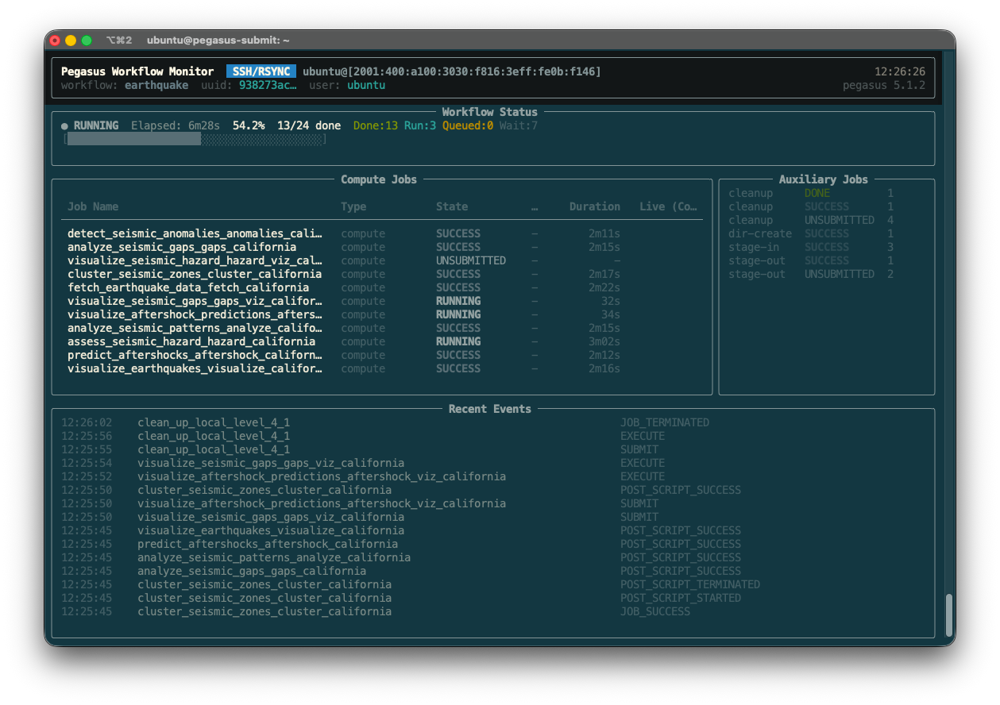

# workflow-monitor

A real-time terminal dashboard for monitoring running [Pegasus WMS](https://pegasus.isi.edu) workflows. Reads directly from the data sources that Pegasus and HTCondor produce — no source code modifications required, no additional daemons to run.

```
╭──────────────────────────────────────────────────────────────────────────────╮
│ Pegasus Workflow Monitor                                  Refreshed 12:53:48 │
│ workflow: diamond  uuid: bebbd357…  user: stealey              pegasus 5.1.2 │
╰──────────────────────────────────────────────────────────────────────────────╯
╭────────────────────────────── Workflow Status ───────────────────────────────╮
│ ● RUNNING  Elapsed: 1m08s  41.7%  5/12 done  Done:5 Run:1 Queued:0 Wait:6    │
│ [████████████████░░░░░░░░░░░░░░░░░░░░░░░░]                                   │
╰──────────────────────────────────────────────────────────────────────────────╯
╭──────────────────────────────── Compute Jobs ────────────────────────────────╮
│  Job Name                        Type       State      Exit  Duration         │
│  preprocess_ID0000001            compute    SUCCESS    0       1m00s          │
│  analyze_ID0000004               compute    RUNNING    -         22s          │
│  findrange_ID0000003             compute    SUCCESS    0         45s          │
│  findrange_ID0000002             compute    SUCCESS    0         41s          │
╰──────────────────────────────────────────────────────────────────────────────╯
╭─────────────────────────────── Recent Events ────────────────────────────────╮
│ 12:55:31    analyze_ID0000004                       EXECUTE                  │
│ 12:55:31    analyze_ID0000004                       SUBMIT                   │
│ 12:55:26    findrange_ID0000002                     POST_SCRIPT_SUCCESS      │
│ ...                                                                          │
╰──────────────────────────────────────────────────────────────────────────────╯
```

## Features

- **Near real-time** — polls the Pegasus stampede database every 2 seconds (configurable)
- **Live HTCondor queue** — overlays live `condor_q` status on running jobs
- **Zero workflow modification** — reads only from files Pegasus and HTCondor already produce
- **Credential-aware** — supports IDTOKEN, X.509/GSI certificates, and password file auth for remote pools; local pools need nothing
- **Flexible target** — point at a workflow base directory, a specific run directory, or a `braindump.yml` file directly
- **Non-interactive mode** — `--once` for scripting, CI, or quick status checks

## Requirements

- Python 3.9+
- [uv](https://docs.astral.sh/uv/) package manager
- A planned and running (or completed) Pegasus workflow
- HTCondor with `condor_q` on `PATH` (for live queue data)

## Installation

Clone the repository and sync dependencies with uv:

```bash
git clone <repo-url> workflow-monitor
cd workflow-monitor
uv sync
```

The `workflow-monitor` command is installed into the project's virtual environment and available via `uv run`.

### Optional: HTCondor Python bindings

If the `htcondor` Python package is available and architecture-compatible, the monitor will prefer it over the `condor_q` subprocess for live queue data:

```bash
uv sync --extra htcondor
```

On systems where the bindings are unavailable (e.g., architecture mismatch on macOS), the monitor falls back to `condor_q -json` automatically with no configuration needed.

## Quick Start

```bash
# Monitor the latest run under a workflow directory (live TUI, Ctrl+C to exit)
uv run workflow-monitor /path/to/diamond-workflow

# Monitor a specific run directory
uv run workflow-monitor /path/to/submit/stealey/pegasus/diamond/run0003

# Print current status once and exit
uv run workflow-monitor --once /path/to/diamond-workflow
```

### With the example diamond workflow

```bash
# 1. Activate the Pegasus environment
cd /path/to/pegasus-macos-local
source .venv/bin/activate
. ~/condor/condor.sh

# 2. Plan and submit the workflow
cd diamond-workflow
bash plan.sh
pegasus-run submit/stealey/pegasus/diamond/run0001

# 3. In another terminal, start the monitor
cd /path/to/workflow-monitor
uv run workflow-monitor /path/to/pegasus-macos-local/diamond-workflow
```

## Usage

```
usage: workflow-monitor [-h] [--version] [--interval SECONDS] [--all-jobs]
                        [--events N] [--once] [--schedd NAME]
                        [--collector HOST[:PORT]] [--token PATH] [--cert PATH]
                        [--key PATH] [--password-file PATH]
                        [TARGET]
```

### Positional argument

| Argument | Description |
|----------|-------------|
| `TARGET` | Workflow submit directory, base directory, or `braindump.yml` file. Defaults to the current working directory. |

The `TARGET` is resolved in this order:
1. If it is a `braindump.yml` file, use it directly.
2. If it is a directory containing `braindump.yml`, use that run.
3. Otherwise, search recursively for `braindump.yml` files and use the **latest run** found (highest-numbered `runNNNN` directory).

### General options

| Flag | Default | Description |
|------|---------|-------------|
| `--interval SECONDS`, `-i` | `2.0` | Stampede database poll interval in seconds. |
| `--all-jobs`, `-a` | off | Show all job types (stage-in/out, cleanup, etc.) in the job table, not just compute jobs. |
| `--events N`, `-e` | `15` | Number of recent job-state events to show in the events panel. |
| `--once` | off | Print the current status once and exit. Useful for scripting. |
| `--version`, `-V` | — | Print the version and exit. |

### HTCondor options

| Flag | Description |
|------|-------------|
| `--schedd NAME` | Query a specific named `condor_schedd`. Useful when multiple schedds are present or for remote pools. |
| `--collector HOST[:PORT]` | Address of the HTCondor collector for the target pool (e.g. `cm.example.org:9618`). |

### Credential options

Credentials are **not required** for local pools configured with open read access (`ALLOW_READ = *`). For secured or remote pools, pass credentials via flags or environment variables.

| Flag | Environment variable | Description |
|------|---------------------|-------------|
| `--token PATH` | `_CONDOR_SEC_TOKEN_DIRECTORY` | Path to an HTCondor IDTOKEN file or a directory containing tokens. |
| `--cert PATH` | `X509_USER_CERT` | Path to a GSI / X.509 certificate file. |
| `--key PATH` | `X509_USER_KEY` | Path to the private key corresponding to `--cert`. |
| `--password-file PATH` | `_CONDOR_PASSWORD_FILE` | Path to an HTCondor password file. |

Credentials set via environment variables before invocation are also respected; the flags take precedence.

## Dashboard panels

### Header
Displays the workflow label, shortened UUID, submitting user, Pegasus planner version, and the last-refreshed time.

### Workflow Status
Shows the current workflow state (`RUNNING`, `SUCCESS`, or `FAILED`), elapsed wall-clock time, percentage complete, job counts by category, and a progress bar. Failed jobs are indicated in red on the bar.

### Compute Jobs (or All Jobs with `--all-jobs`)
A table of individual jobs with:

| Column | Description |
|--------|-------------|
| **Job Name** | The DAG node name (e.g. `preprocess_ID0000001`) |
| **Type** | Job category: `compute`, `stage-in`, `stage-out`, `dir-create`, `cleanup`, `register` |
| **State** | Simplified state — see [Job states](#job-states) |
| **Exit** | Exit code when the job has completed |
| **Duration** | Wall time from `EXECUTE` to `JOB_TERMINATED`; updates live for running jobs |
| **Live (Condor)** | Real-time HTCondor queue status (`Idle`, `Running`, `Held`, etc.) |

### Infrastructure
A compact summary of non-compute jobs grouped by type and state. Hidden when no infrastructure jobs have been seen yet.

### Recent Events
A chronological list of the most recent job-state transitions. Each row shows the time, job name, and raw Pegasus event name. The number of rows is controlled by `--events`.

## Job states

| Display state | Meaning |
|---------------|---------|
| `UNSUBMITTED` | Job exists in the DAG but has not been submitted yet (waiting on dependencies) |
| `QUEUED` | Submitted to HTCondor; waiting to be matched to a slot |
| `PRE` | Pre-script is running |
| `RUNNING` | Job is executing on a worker node |
| `POST` | Post-script is running |
| `SUCCESS` | Job completed successfully (post-script returned 0) |
| `FAILED` | Job or post-script exited non-zero |
| `HELD` | Job is held in the HTCondor queue |

## Architecture

The monitor reads from three data sources produced by a running workflow, with no modifications to Pegasus or HTCondor:

```
Pegasus workflow run
        │
        ├── braindump.yml          ← workflow metadata (UUID, submit dir, dag name)
        │
        ├── <dag>.stampede.db      ← SQLite database written by pegasus-monitord
        │       tables: workflow, workflowstate, job, job_instance, jobstate, invocation
        │
        └── condor_q / htcondor    ← live HTCondor queue (Python bindings or subprocess)
```

### `braindump.py`
Locates and parses `braindump.yml` from any of the three accepted `TARGET` forms. Provides paths to all workflow artifacts.

### `db.py`
Queries the stampede SQLite database in read-only mode. The database is written continuously by `pegasus-monitord` as the workflow progresses. Handles `OperationalError: database is locked` gracefully during concurrent writes.

### `htcondor_poll.py`
Queries the live HTCondor job queue. Tries the `htcondor` and `htcondor2` Python packages first; falls back to `condor_q -json` if the packages are unavailable or fail (e.g. architecture mismatch). Credential setup is applied before any query attempt.

### `display.py`
Builds and drives the Rich terminal dashboard. In live mode (`without --once`), renders inside a `rich.live.Live` context that refreshes every `--interval` seconds. Exits automatically when `WORKFLOW_TERMINATED` is observed in the database.



## Troubleshooting

**"Stampede database not found"**
The `*.stampede.db` file is created by `pegasus-monitord` shortly after `pegasus-run` is called. If the workflow was planned with `pegasus-plan` but not yet started with `pegasus-run`, this file will not exist. Start the workflow first, then run the monitor.

**Live (Condor) column is always empty**
The monitor could not reach the HTCondor schedd. Ensure `condor_q` is on your `PATH` (e.g. `. ~/condor/condor.sh`) and that the schedd is running. For remote pools, supply `--collector` and any required credential flags.

**Dashboard appears garbled or cut off**
The Rich layout adapts to your terminal size. Widen the terminal window for best results. A minimum width of ~100 columns is recommended.

**Workflow shows RUNNING but condor_q shows no jobs**
This is normal at the very start of a run while DAGMan is initializing, and during transitions between DAG nodes. The `UNSUBMITTED` state in the job table indicates jobs that are waiting on upstream dependencies.

## Development

```bash
# Install in editable mode with all dependencies
uv sync

# Run the monitor directly from source
uv run workflow-monitor --help

# Run against a completed workflow (no HTCondor required)
uv run workflow-monitor --once /path/to/workflow
```

The project uses [hatchling](https://hatch.pypa.io/) as its build backend and [uv](https://docs.astral.sh/uv/) as the package and virtual environment manager.

## License

See repository root for license information.
