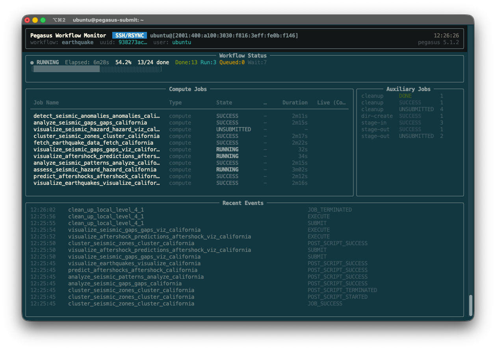

# workflow-monitor

A real-time terminal dashboard for monitoring running [Pegasus WMS](https://pegasus.isi.edu) workflows. Reads directly from the data sources that Pegasus and HTCondor produce — no source code modifications required, no additional daemons to run.

```
╭──────────────────────────────────────────────────────────────────────────────╮
│ Pegasus Workflow Monitor   LIVE                           Refreshed 12:42:07 │
│ workflow: earthquake  uuid: 60843726…  user: stealey           pegasus 5.1.2 │
╰──────────────────────────────────────────────────────────────────────────────╯
╭────────────────────────────── Workflow Status ───────────────────────────────╮
│ ● RUNNING  Elapsed: 1m42s  60.0%  21/35 done  Done:21 Run:3 Queued:0 Wait:11 │
│ [████████████████████████░░░░░░░░░░░░░░░░]                                   │
╰──────────────────────────────────────────────────────────────────────────────╯
╭──────────────────────────────── Compute Jobs ────────────────────────────────╮
│  Job                  Type    State   Exit  Duration  Args           Mem     │
│  fetch_earthquake_…  compute  SUCCESS  0       12s  --region …    109.2M     │
│  detect_seismic_an…  compute  SUCCESS  0       15s  --input c…    167.1M     │
│  cluster_seismic_z…  compute  RUNNING  -       18s  --input c…         -     │
│  assess_seismic_ha…  compute  RUNNING  -       12s  --input c…         -     │
│  visualize_earthqu…  compute  SUCCESS  0       10s  --input c…    320.6M     │
╰──────────────────────────────────────────────────────────────────────────────╯
╭─────────────────────────────── Recent Events ────────────────────────────────╮
│  Job                     State    Start       End        Duration       Mem  │
│  cluster_seismic_zo…    RUNNING   12:42:07    -              18s          -  │
│  assess_seismic_haz…    RUNNING   12:42:07    -              12s          -  │
│  detect_seismic_ano…    SUCCESS   12:42:07    12:42:22       15s     167.1M  │
│  analyze_seismic_ga…    SUCCESS   12:42:07    12:42:22       15s     167.2M  │
│  ...                                                                        │
╰──────────────────────────────────────────────────────────────────────────────╯
```

## Features

- **Near real-time** — polls the Pegasus stampede database every 2 seconds (configurable)
- **Live HTCondor queue** — overlays live `condor_q` status on running jobs
- **Diagnostics** — pattern-matches HTCondor hold reasons and kickstart stderr to surface actionable suggestions for held and failed jobs
- **Zero workflow modification** — reads only from files Pegasus and HTCondor already produce
- **Credential-aware** — supports IDTOKEN, X.509/GSI certificates, and password file auth for remote pools; local pools need nothing
- **Flexible target** — point at a workflow base directory, a specific run directory, or a `braindump.yml` file directly
- **Non-interactive mode** — `--once` for scripting, CI, or quick status checks
- **Event logging** — `--log` captures every workflow and job state transition to a JSONL file for replay or post-hoc analysis
- **Replay mode** — `--replay` reads a JSONL event log and visually replays the workflow in the TUI at configurable speed (`--speed`)
- **Client/Server mode** — `--serve` runs a headless daemon on the workflow machine that logs events continuously; `--remote` connects from any machine via SSH to display the workflow in the TUI

## Requirements

- Python 3.9+
- [uv](https://docs.astral.sh/uv/) package manager
- A planned and running (or completed) Pegasus workflow (not needed for `--replay` or `--remote`)
- HTCondor with `condor_q` on `PATH` (for live queue data; not needed for `--replay` or `--remote`)
- SSH access to the remote host (for `--remote` client mode only)

## Installation

Clone the repository and sync dependencies with uv:

```bash
git clone <repo-url> workflow-monitor
cd workflow-monitor
uv sync
```

The `workflow-monitor` command is installed into the project's virtual environment and available via `uv run`.

### Optional: HTCondor Python bindings

If the `htcondor` Python package is available and architecture-compatible, the monitor will prefer it over the `condor_q` subprocess for live queue data:

```bash
uv sync --extra htcondor
```

On systems where the bindings are unavailable (e.g., architecture mismatch on macOS), the monitor falls back to `condor_q -json` automatically with no configuration needed.

## Quick Start

```bash
# Monitor the latest run under a workflow directory (live TUI, Ctrl+C to exit)
uv run workflow-monitor /path/to/diamond-workflow

# Monitor a specific run directory
uv run workflow-monitor /path/to/submit/stealey/pegasus/diamond/run0003

# Print current status once and exit
uv run workflow-monitor --once /path/to/diamond-workflow

# Monitor with JSONL event logging (auto-path in submit dir)
uv run workflow-monitor --log /path/to/diamond-workflow

# Log events to a specific file
uv run workflow-monitor --log /tmp/events.jsonl /path/to/diamond-workflow

# Replay a recorded event log (no live workflow or HTCondor needed)
uv run workflow-monitor --replay example-logs/workflow-events.jsonl

# Replay at 4x speed
uv run workflow-monitor --replay example-logs/workflow-events.jsonl --speed 4

# Start a headless server on the workflow machine (daemonizes, survives terminal exit)
uv run workflow-monitor --serve /path/to/diamond-workflow

# Monitor a remote workflow via SSH from another machine
uv run workflow-monitor --remote user@host:/path/to/submit_dir/workflow-events.jsonl

# Remote monitoring with SSH config and identity file (e.g. FABRIC testbed)
uv run workflow-monitor \
  --remote 'ubuntu@[2001:db8::1]:/home/ubuntu/pegasus/earthquake/run0001/workflow-events.jsonl' \
  --ssh-config ~/.ssh/fabric-ssh-config \
  --ssh-identity ~/.ssh/my-sliver-key

# Stop a running server daemon
uv run workflow-monitor --stop-server /path/to/diamond-workflow
```

## Usage

```
usage: workflow-monitor [-h] [--version] [--interval SECONDS] [--all-jobs]
                        [--events N] [--once] [--log [PATH]] [--replay PATH]
                        [--speed MULTIPLIER] [--serve] [--serve-foreground]
                        [--stop-server [PID_FILE]] [--remote USER@HOST:/PATH]
                        [--sync-interval SECONDS] [--ssh-config PATH]
                        [--ssh-identity PATH] [--schedd NAME]
                        [--collector HOST[:PORT]] [--token PATH] [--cert PATH]
                        [--key PATH] [--password-file PATH]
                        [TARGET]
```

### Positional argument

| Argument | Description |
|----------|-------------|
| `TARGET` | Workflow submit directory, base directory, or `braindump.yml` file. Defaults to the current working directory. |

The `TARGET` is resolved in this order:
1. If it is a `braindump.yml` file, use it directly.
2. If it is a directory containing `braindump.yml`, use that run.
3. Otherwise, search recursively for `braindump.yml` files and use the **latest run** found (highest-numbered `runNNNN` directory).

### General options

| Flag | Default | Description |
|------|---------|-------------|
| `--interval SECONDS`, `-i` | `2.0` | Stampede database poll interval in seconds. |
| `--all-jobs`, `-a` | off | Show all job types (stage-in/out, cleanup, etc.) in the job table, not just compute jobs. |
| `--events N`, `-e` | `15` | Number of recent job-state events to show in the events panel. |
| `--once` | off | Print the current status once and exit. Useful for scripting. Works with all modes including `--remote`. |
| `--log [PATH]` | off | Log all events to a JSONL file. If `PATH` is omitted, writes to `{submit_dir}/workflow-events.jsonl`. |
| `--replay PATH` | — | Replay a JSONL event log in the TUI dashboard (no live workflow needed). |
| `--speed MULTIPLIER` | `1.0` | Replay speed multiplier (e.g. `4` = 4x speed, `0.5` = half speed). Only used with `--replay`. |
| `--version`, `-V` | — | Print the version and exit. |

### HTCondor options

| Flag | Description |
|------|-------------|
| `--schedd NAME` | Query a specific named `condor_schedd`. Useful when multiple schedds are present or for remote pools. |
| `--collector HOST[:PORT]` | Address of the HTCondor collector for the target pool (e.g. `cm.example.org:9618`). |

### Credential options

Credentials are **not required** for local pools configured with open read access (`ALLOW_READ = *`). For secured or remote pools, pass credentials via flags or environment variables.

| Flag | Environment variable | Description |
|------|---------------------|-------------|
| `--token PATH` | `_CONDOR_SEC_TOKEN_DIRECTORY` | Path to an HTCondor IDTOKEN file or a directory containing tokens. |
| `--cert PATH` | `X509_USER_CERT` | Path to a GSI / X.509 certificate file. |
| `--key PATH` | `X509_USER_KEY` | Path to the private key corresponding to `--cert`. |
| `--password-file PATH` | `_CONDOR_PASSWORD_FILE` | Path to an HTCondor password file. |

Credentials set via environment variables before invocation are also respected; the flags take precedence.

## Operating Modes

The monitor has four operating modes, each indicated by a badge in the dashboard header:

| Mode | Badge | Data source | Requires |
|------|-------|-------------|----------|
| **Live** | `LIVE` (green) | stampede.db + condor_q | Local Pegasus workflow + HTCondor |
| **Server** | *(headless, no TUI)* | stampede.db + condor_q → JSONL | Local Pegasus workflow + HTCondor |
| **Remote/SSH** | `SSH` (blue) | JSONL via SSH | SSH access to server host |
| **Replay** | `REPLAY` (orange) | JSONL file | Nothing (fully offline) |

### Live mode (default)

Polls the stampede database and HTCondor queue directly on the same machine where the workflow is running. This is the richest mode — all diagnostics, including kickstart stderr analysis, are available.

### Server mode (`--serve`)

Runs the same polling loop as live mode but without a terminal UI. Writes a JSONL event log continuously. Designed to run on the workflow machine (submit node) so that remote clients can consume the log.

The server captures HTCondor ClassAd data (including `HoldReason`, `JobStatus`) in `htcondor_poll` events, making diagnostics available to SSH clients. The event stream uses fingerprint-based deduplication — changes to job attributes (not just the set of job IDs) trigger new events.

```bash
# Start as daemon (double-fork, survives terminal exit)
uv run workflow-monitor --serve /path/to/workflow

# Start in foreground (for debugging; Ctrl+C to stop)
uv run workflow-monitor --serve-foreground /path/to/workflow

# Start with custom log path and poll interval
uv run workflow-monitor --serve --log /tmp/my-events.jsonl --interval 5 /path/to/workflow

# Stop a running daemon
uv run workflow-monitor --stop-server /path/to/workflow
```

When `--serve` is used, the monitor:
1. Locates the workflow (same as normal mode)
2. Prints the log file path and PID file location
3. Double-forks to detach from the terminal (daemonize)
4. Polls the stampede database at `--interval` and writes events to the JSONL log
5. Exits automatically when the workflow completes, writing a final `workflow_end` event
6. Cleans up the PID file on exit

The PID file is written alongside the log file with a `.pid` extension (e.g., `workflow-events.pid`). Daemon stdout/stderr is redirected to a `.pid.log` file for diagnostics.

**Tip:** On some systems (e.g., FABRIC), `screen -dmS monitor uv run workflow-monitor --serve-foreground ...` is more reliable than the double-fork daemon.

### Remote/SSH mode (`--remote`)

Fetches the JSONL log from a remote machine via SSH and displays it in the TUI. The header shows an `SSH` badge with the remote host. After the initial full download, only new bytes are transferred each sync cycle using incremental byte-offset fetching (`tail -c +N`), minimizing bandwidth and memory usage.

```bash
# Basic usage
uv run workflow-monitor --remote user@host:/path/to/workflow-events.jsonl

# With custom sync interval (default: 5 seconds)
uv run workflow-monitor --remote user@host:/path/to/events.jsonl --sync-interval 10

# Print once and exit (non-interactive)
uv run workflow-monitor --remote user@host:/path/to/events.jsonl --once

# Show all job types
uv run workflow-monitor --remote user@host:/path/to/events.jsonl --all-jobs
```

The client can connect and disconnect at any time without affecting the workflow or the server. When the client reconnects, it catches up to the current state automatically. The server's resume-aware event logger ensures no duplicate headers or events across restarts.

#### SSH configuration

For hosts that require specific SSH settings (config files, identity keys, bastion/jump hosts), use `--ssh-config` and `--ssh-identity`:

```bash
uv run workflow-monitor \
  --remote 'ubuntu@[2001:db8::1]:/home/ubuntu/pegasus/earthquake/run0001/workflow-events.jsonl' \
  --ssh-config ~/.ssh/my-ssh-config \
  --ssh-identity ~/.ssh/my-private-key
```

These flags are passed directly to `ssh -F` and `ssh -i` respectively, so any SSH config features are supported — including `ProxyJump` for bastion hosts, `StrictHostKeyChecking`, and `ServerAliveInterval`.

**IPv6 addresses** must be enclosed in square brackets in the remote spec (e.g., `user@[2001:db8::1]:/path`). The brackets are stripped automatically before passing to SSH.

#### Example: FABRIC testbed

[FABRIC](https://fabric-testbed.net/) uses a bastion host with ProxyJump. A typical SSH config (`~/.ssh/fabric-ssh-config`):

```
UserKnownHostsFile /dev/null
StrictHostKeyChecking no
ServerAliveInterval 120

Host bastion.fabric-testbed.net
     User <FABRIC_BASTION_USERNAME>
     ForwardAgent yes
     Hostname %h
     IdentityFile <FABRIC_BASTION_PRIVATE_KEY_LOCATION>
     IdentitiesOnly yes

Host * !bastion.fabric-testbed.net
     ProxyJump <FABRIC_BASTION_USERNAME>@bastion.fabric-testbed.net:22
```

Monitor command:

```bash
uv run workflow-monitor \
  --remote 'ubuntu@[2001:400:a100:3030:f816:3eff:fe0b:f146]:/home/ubuntu/earthquake-workflow/ubuntu/pegasus/earthquake/run0002/workflow-events.jsonl' \
  --ssh-config ~/.ssh/fabric-ssh-config \
  --ssh-identity ~/.ssh/pegasusai-sliver
```

### Replay mode (`--replay`)

Reads a JSONL event log (produced by `--log` or `--serve`) and visually replays the workflow in the same Rich TUI dashboard. No live Pegasus workflow or HTCondor environment is required — useful for demos, post-hoc review, and debugging.

```bash
# Replay at normal speed
uv run workflow-monitor --replay example-logs/workflow-events.jsonl

# Replay at 4x speed
uv run workflow-monitor --replay example-logs/workflow-events.jsonl --speed 4

# Slow-motion replay
uv run workflow-monitor --replay example-logs/workflow-events.jsonl --speed 0.5

# Show all job types (including infrastructure)
uv run workflow-monitor --replay example-logs/workflow-events.jsonl --all-jobs
```

The header displays a `REPLAY` badge and the current speed multiplier. Events are grouped by timestamp and paced according to the original timing, scaled by `--speed`. Press `Ctrl+C` to exit early.

### Client/Server options

| Flag | Default | Description |
|------|---------|-------------|
| `--serve` | off | Run as a headless server daemon. Daemonizes and survives terminal exit. |
| `--serve-foreground` | off | Run the server in the foreground (for debugging). |
| `--stop-server [PID_FILE]` | — | Stop a running server daemon. If `PID_FILE` is omitted, locates it from the workflow target. |
| `--remote USER@HOST:/PATH` | — | Monitor a remote workflow via SSH. No local Pegasus or HTCondor required. |
| `--sync-interval SECONDS` | `5.0` | How often the client fetches the remote log file. |
| `--ssh-config PATH` | — | SSH config file passed as `ssh -F <PATH>`. |
| `--ssh-identity PATH` | — | SSH identity/key file passed as `ssh -i <PATH>`. |

## Dashboard Panels

### Header
Displays the workflow label, shortened UUID, submitting user, Pegasus planner version, mode badge, and the last-refreshed time.

### Workflow Status
Shows the current workflow state (`RUNNING`, `SUCCESS`, or `FAILED`), elapsed wall-clock time, percentage complete, job counts by category, and a progress bar. Failed jobs are indicated in red on the bar.

### Diagnostics (conditional)
Appears automatically when jobs are held or have failed. For each problematic job, shows:
- A one-line summary of the issue (e.g., "Job exceeded memory limit", "Output file transfer failed")
- The underlying reason (HTCondor hold reason, exit code, or kickstart stderr excerpts)
- Actionable remediation suggestions

Diagnostics are powered by pattern matching against:
- **HTCondor hold reasons** — 11 regex patterns covering transfer failures, resource limits, credential issues, container errors, and more
- **Exit codes** — maps common codes (1, 2, 126, 127, 137, 139) to likely causes
- **Kickstart stderr** — detects missing files, transfer failures, permission denied, disk full, and connection errors

In live mode, kickstart `.out.000` files are parsed directly from the submit directory. In SSH/remote mode, diagnostics use the HTCondor ClassAd data captured in `htcondor_poll` JSONL events.

### Compute Jobs (or All Jobs with `--all-jobs`)
A table of individual jobs with:

| Column | Description |
|--------|-------------|
| **Job** | Transformation name for compute jobs (e.g. `detect_seismic_anomalies`), DAG node name for infrastructure jobs |
| **Type** | Job category: `compute`, `stage-in`, `stage-out`, `dir-create`, `cleanup`, `register` |
| **State** | Simplified state — see [Job states](#job-states) |
| **Exit** | Exit code when the job has completed |
| **Duration** | Wall time from `EXECUTE` to `JOB_TERMINATED`; updates live for running jobs |
| **Args** | Task arguments from the Pegasus workflow definition (truncated to 40 chars); compute jobs only |
| **Mem** | Peak resident memory (maxrss) from the kickstart invocation record; populated after job completion |
| **Live** | Real-time HTCondor queue status (`Idle`, `Running`, `Held`, etc.) |

### Auxiliary Jobs
A compact summary of non-compute jobs (stage-in/out, directory creation, cleanup, registration) grouped by type and state. Hidden when no auxiliary jobs have been seen yet.

### Recent Events
A per-job activity summary showing the most recently active jobs, sorted by completion time (newest first). The number of rows is controlled by `--events`.

| Column | Description |
|--------|-------------|
| **Job** | Transformation name for compute jobs, DAG node name for infrastructure jobs |
| **State** | Simplified display state |
| **Start** | Time the job began executing (or was submitted) |
| **End** | Time the job terminated |
| **Duration** | Wall-clock time from start to end; updates live for running jobs |
| **Mem** | Peak resident memory from the kickstart invocation record |

## Event Log Format

When `--log` or `--serve` is active, the monitor writes a JSONL (JSON Lines) file where each line is a self-contained JSON object. This file can be replayed with `--replay`, streamed to an SSH client with `--remote`, or ingested into analytics tools.

### Event types

| Event type | Emitted when | Key fields |
|------------|-------------|------------|
| `workflow_start` | Logger initializes (first line) | `dax_label`, `user`, `planner_version`, `submit_dir`, `wf_start` |
| `jobs_init` | First snapshot | `total_jobs`, `jobs` (list of `{job_id, exec_job_id, type_desc, transformation, task_argv}`) |
| `workflow_state` | Workflow state changes | `state` (`WORKFLOW_STARTED`, `WORKFLOW_TERMINATED`), `status`, `wf_start`/`wf_end` |
| `job_state` | A job transitions to a new state | `exec_job_id`, `type_desc`, `state`, `job_id`, `exitcode`, `stdout_file`, `stderr_file`, `maxrss` |
| `htcondor_poll` | HTCondor queue contents or attributes change | `jobs` (list of ClassAd dicts including `HoldReason`, `JobStatus`) |
| `workflow_end` | Monitor exits (last line) | `wf_state`, `wf_status`, `wf_end`, `total_jobs`, `done`, `failed`, `elapsed` |

Every event includes `event_type`, `timestamp` (Unix float), and `wf_uuid`.

The logger is resume-aware — if the server restarts, it detects the existing log, recovers its state (high-water timestamp, last workflow state), truncates any trailing `workflow_end` marker, and appends new events seamlessly.

### Example

```bash
# Monitor and log
uv run workflow-monitor --log /path/to/workflow

# Inspect the log
cat /path/to/submit/dir/workflow-events.jsonl | python -m json.tool
```

## Job States

| Display state | Meaning |
|---------------|---------|
| `UNSUBMITTED` | Job exists in the DAG but has not been submitted yet (waiting on dependencies) |
| `QUEUED` | Submitted to HTCondor; waiting to be matched to a slot |
| `PRE` | Pre-script is running |
| `RUNNING` | Job is executing on a worker node |
| `POST` | Post-script is running |
| `SUCCESS` | Job completed successfully (post-script returned 0) |
| `FAILED` | Job or post-script exited non-zero |
| `HELD` | Job is held in the HTCondor queue |

## Architecture

The monitor reads from three data sources produced by a running workflow, with no modifications to Pegasus or HTCondor:

```
Pegasus workflow run
        │
        ├── braindump.yml          ← workflow metadata (UUID, submit dir, dag name)
        │
        ├── <dag>.stampede.db      ← SQLite database written by pegasus-monitord
        │       tables: workflow, workflowstate, job, job_instance, jobstate,
        │               task, invocation, rc_lfn, rc_meta
        │
        └── condor_q / htcondor    ← live HTCondor queue (Python bindings or subprocess)
```

In client/server mode, the data flows through a JSONL log file:

```
┌─────────────────────── Server machine ───────────────────────┐
│                                                              │
│  stampede.db ──┐                                             │
│                ├──▶ server daemon ──▶ workflow-events.jsonl  │
│  condor_q ──-──┘         (--serve)                           │
│                                                              │
└──────────────────────────────┬───────────────────────────────┘
                               │ SSH (incremental tail -c / cat)
┌──────────────────────────────▼───────────────────────────────┐
│                                                              │
│  client (--remote) ──▶ Rich TUI  [SSH badge]                 │
│                                                              │
└─────────────────────── Client machine ───────────────────────┘
```

### Modules

| Module | Purpose |
|--------|---------|
| `braindump.py` | Locates and parses `braindump.yml` from any accepted `TARGET` form. Provides paths to all workflow artifacts. |
| `db.py` | Queries the stampede SQLite database in read-only mode. Handles `database is locked` gracefully during concurrent writes. |
| `htcondor_poll.py` | Queries the live HTCondor queue. Tries Python bindings first; falls back to `condor_q -json`. Applies credential setup before queries. |
| `display.py` | Builds and drives the Rich terminal dashboard. Renders inside `rich.live.Live` with configurable refresh. Supports mode badges. |
| `diagnostics.py` | Pattern-matches held and failed jobs against HTCondor hold reasons, exit codes, and kickstart stderr for actionable suggestions. |
| `event_log.py` | JSONL event logger with resume support. Tracks high-water timestamps to avoid duplicates. Fingerprint-based HTCondor poll dedup. |
| `replay.py` | Loads a JSONL event log and replays it through the TUI at configurable speed. Handles multi-session logs. |
| `server.py` | Headless daemon for client/server mode. Daemonizes via double-fork. Writes PID file for lifecycle management. |
| `remote.py` | SSH client engine. Incremental byte-offset fetching. Reconstructs workflow state from events. Supports `--once`. |



## Related Projects

### [predictable-workflow-failures](https://github.com/pegasusai/predictable-workflow-failures)

Generates Pegasus workflows with predictable, labeled failure modes — 7 scenarios covering exit codes, missing input, memory exceeded, timeout, dependency cascades, and transfer failures. Use it to:

- **Test workflow-monitor** across all failure categories on any Pegasus/HTCondor environment
- **Validate diagnostics** — each scenario triggers a specific diagnostic pattern (held, failed, cascading)
- **Compare monitoring modes** — run the same scenario with live TUI vs. SSH client to verify parity

Typical testing workflow:

```bash
# On the submit node: generate and run a failure scenario
uv run workflow-generator generate memory_exceeded -o ./generated
cd generated/memory_exceeded && python3 workflow_memory_exceeded.py

# Start the server daemon
uv run workflow-monitor --serve /path/to/submit/run0001

# From your local machine: monitor via SSH
uv run workflow-monitor --remote user@host:/path/to/workflow-events.jsonl
```

## Troubleshooting

**"Stampede database not found"**
The `*.stampede.db` file is created by `pegasus-monitord` shortly after `pegasus-run` is called. If the workflow was planned with `pegasus-plan` but not yet started with `pegasus-run`, this file will not exist. Start the workflow first, then run the monitor.

**Live (Condor) column is always empty**
The monitor could not reach the HTCondor schedd. Ensure `condor_q` is on your `PATH` (e.g. `. ~/condor/condor.sh`) and that the schedd is running. For remote pools, supply `--collector` and any required credential flags.

**Dashboard appears garbled or cut off**
The Rich layout adapts to your terminal size. Widen the terminal window for best results. A minimum width of ~100 columns is recommended.

**Workflow shows RUNNING but condor_q shows no jobs**
This is normal at the very start of a run while DAGMan is initializing, and during transitions between DAG nodes. The `UNSUBMITTED` state in the job table indicates jobs that are waiting on upstream dependencies.

**SSH mode shows "No hold reason available" but LIVE shows the hold reason**
Make sure the server was started with HTCondor accessible (`condor_q` on PATH). The server captures hold reasons via `htcondor_poll` events in the JSONL. If the server was started without HTCondor access, or if the job was held after the server stopped, the hold reason won't be in the log.

**Server daemon dies silently**
Check the daemon log file at `<log_path>.pid.log` (e.g., `workflow-events.pid.log`). On some systems, `screen -dmS monitor uv run workflow-monitor --serve-foreground ...` is more reliable than the double-fork daemon.

## Development

```bash
# Install in editable mode with all dependencies
uv sync

# Run the monitor directly from source
uv run workflow-monitor --help

# Run against a completed workflow (no HTCondor required)
uv run workflow-monitor --once /path/to/workflow

# Replay the bundled example log (no Pegasus or HTCondor required)
uv run workflow-monitor --replay example-logs/workflow-events.jsonl --speed 4
```

The project uses [hatchling](https://hatch.pypa.io/) as its build backend and [uv](https://docs.astral.sh/uv/) as the package and virtual environment manager.

## Tested Platforms

| Platform | Pegasus | HTCondor | Mode | Pool |
|----------|---------|----------|------|------|
| macOS arm64 (Homebrew) | 5.1.2 | 25.6.1 | Live, Replay | Single-node `minicondor` |
| Ubuntu 24.04 x86_64 (FABRIC) | 5.1.2 | 24.12.17 | Live, Server, SSH | Multi-node (submit + 2 workers) |

## License

Apache-2.0. See [LICENSE](LICENSE) for details.
